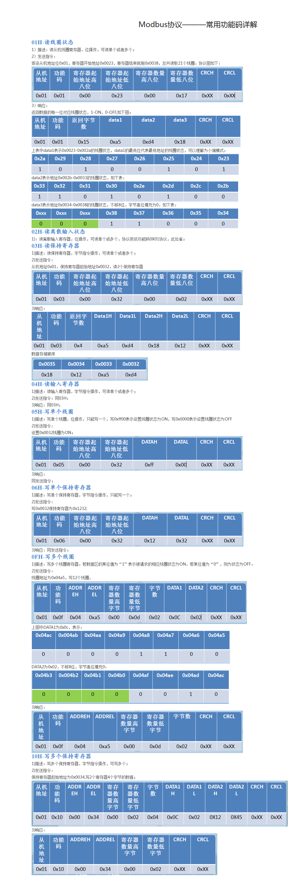

# 寄存器分类
Modbus寄存器分为四种

| 寄存器种类 | 数据类型 | 访问类型 | 功能码 | PLC地址 | 寄存器地址 |
| - | - | - | - | - | - |
| 线圈寄存器	| 位	| 读写	| 01H 05H 0FH	| 00001-09999	| 0000H-FFFFH| 
| 离散输入寄存器	| 位	| 只读	| 02H	| 10001-19999	| 0000H-FFFFH| 
| 输入寄存器	| 字	| 只读	| 04H	| 30001-39999	| 0000H-FFFFH| 
| 保持寄存器	| 字	| 读写	| 03H 06H 10H	| 40001-49999	| 0000H-FFFFH| 

# modbus 状态说明
01：COIL STATUS（线圈状态）：用于读取和控制远程设备的开关状态，通常用于控制继电器等开关设备。

02：INPUT STATUS（输入状态）：用于读取远程设备的输入状态，通常用于读取传感器等输入设备的状态。

03：HOLDING REGISTER（保持寄存器）：用于存储和读取远程设备的数据，通常用于存储控制参数、设备状态等信息。

04：INPUT REGISTER（输入寄存器）：用于存储远程设备的输入数据，通常用于存储传感器等输入设备的数据。

# 功能码

Modbus是一种单主站的主/从通讯模式。Modbus网络上只有一个主站，主站在Modbus网络上没有地址，从站的地址范围为0-247，其中0为广播地址，从站的实际地址范围为1-247。

| 代码 | 名称 | 作用 |
| - | - | - |
| 01 | 读取线圈状态 | 取得一组逻辑线圈的当前状态（ON/OFF） |
| 02 | 读取输入状态 | 取得一组开关输入的当前状态（ON/OFF） |
| 03 | 读取保持寄存器 | 在一个或多个保持寄存器中取得当前的二进制值 |
| 04 | 读取输入寄存器 | 在一个或多个输入寄存器中取得当前的二进制值 |
| 05 | 强制单线圈 | 强置一个逻辑线圈的通断状态 |
| 06 | 预置单寄存器| 放置一个热定特定的二进制值到一个单寄存器中 |
| 07 | 读取异常状态 | 取得8个内部线圈的通断状态，这8个线圈的地址由控制器决定，用户逻辑可以将这些线圈定义，以说明从机状态，短报文适宜于迅速读取状态 |
| 08 | 回送诊断校验 | 把诊断校验报文送从机，以对通信处理进行评鉴 |
| 09 | 编程(只用于 484) | 使主机模拟编程器作用，修改PC从机逻辑 |
| 10 | 控询(只用于 484) | 可使主机与一台正在执行长程序任务从机通信，探询该从机是否已完成其操作任务，仅在含有功能码9 的报文发送后，本功能码才发送 |
| 11 | 读取事件计数 | 可使主机发出单询问，并随即判定操作是否成功，尤其是该命令或其他应答产生通信错误时 |
| 12 | 读取通信事件记录 | 可是主机检索每台从机的 ModBus事务处理通信事件记录。如果某项事务处理完成，记录会给出有关错误|
| 13| 编程(184/384 484584) | 可使主机模拟编程器功能修改 PC从机逻辑 |
| 14 | 探询(184/384 484584) | 可使主机与正在执行任务的从机通信，定期控询该从机是否已完成其程序操作，仅在含有功能13的报文发送后，本功能码才得发送 |
| 15 | 强置多线圈 | 强置一串连续逻辑线圈的通断 |
| 16 | 预置多寄存器 | 放置一系列特定的二进制值到一系列多寄存器中，把具体的二进制值装入一串连续的保持寄存器 |
| 17 | 报告从机标识 | 可使主机判断编址从机的类型及该从机运行指示灯的状态 |
| 18 | (884和MICRO 84) | 可使主机模拟编程功能，修改PC状态逻辑 |
| 19 | 重置通信链路 | 发生非可修改错误后，是从机复位于已知状态，可重置顺序字节|

# 常用功能码

|功能码	|描述	|PLC地址	|寄存器地址	|位/字操作|	操作数量|
| - | - | - | - | - | - |
01H	| 读线圈寄存器	| 00001-09999	| 0000H-FFFFH	| 位操作	| 单个或多个 | 
02H	| 读离散输入寄存器	| 10001-19999	| 0000H-FFFFH	| 位操作| 	单个或多个 | 
03H	| 读保持寄存器	| 40001-49999	| 0000H-FFFFH	| 字操作	| 单个或多个 | 
04H	| 读输入寄存器	| 30001-39999	| 0000H-FFFFH	| 字操作	| 单个或多个 | 
05H	| 写单个线圈寄存器	| 00001-09999	| 0000H-FFFFH	| 位操作| 	单个 | 
06H	| 写单个保持寄存器	| 40001-49999	| 0000H-FFFFH	| 字操作| 	单个 | 
0FH	| 写多个线圈寄存器	| 00001-09999	| 0000H-FFFFH	| 位操作| 	多个 | 
10H	| 写多个保持寄存器	| 40001-49999	| 0000H-FFFFH	| 字操作| 	多个 | 

## 功能码详解

https://blog.csdn.net/dengjin20104042056/article/details/116545046

